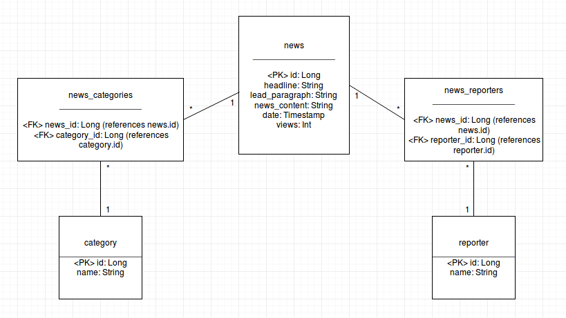

## Introduction

SpringNews is an application for anonymous users to read, create, edit and delete news. News contains also reporters and categories. Frontpage shows the latest news and in addition news can be found by most viewed or filtered by categories. Single news contains headline, leading paragraph, the actual story, reporters and categories. There maybe upcoming update to add a picture for news.

## Application guide

Navigate through the site with the navbar which can be found at the top of the site. You can add new news from the "news" page by clicking "create news" link. Categories and reporters are given, a user is able to create only new news. If you want to find news by particular category, you can go to "categories" and click one of the categories. That should lead you to a page which lists all the news of the site tagged with given category. Since the app is on Heroku, no installation behalf of the user is needed, the app is ready to use.

## Structure

